# Ryzen 5900X BIOS settings

## Otimizing for energy use instead of `xmrig`

Documenting BIOS settings I had made to get the most performance out
of `xmrig` on the Ryzen 5900X before restoring defaults and applying
something more energy efficient.

| Name                       | Info                                                                         |
|:---------------------------|:-----------------------------------------------------------------------------|
| CPU                        | [AMD Ryzen 9 5900X](https://www.amd.com/en/products/cpu/amd-ryzen-9-5900x)   |
| Motherboard                | ASUS B550 Aorus Elite                                                        |
| Manual                     | [`mb_manual_b550-aorus-elite-ax_e.pdf`](mb_manual_b550-aorus-elite-ax_e.pdf) |
| Exported BIOS profile file | [`asus-b550-xmrig.bin`](asus-b550-xmrig.bin)                                 |

### Tuned for `xmrig`

The energy consumption with these settings is quite high:

| State           | Power (W)
|----------------:|:---------------
| booting         | `~130W`
| idle            | `~75W`
| running `xmrig` | `145W`

###  The default BIOS settings loaded

Uses a lot less energy. After setting the cpu frequency govenor to `powersave` with

```shell
cpupower frequency-set -g powersave
```

it uses approx

| State           | Power (W)
|----------------:|:---------------
| idle            | `~38W`


### System info

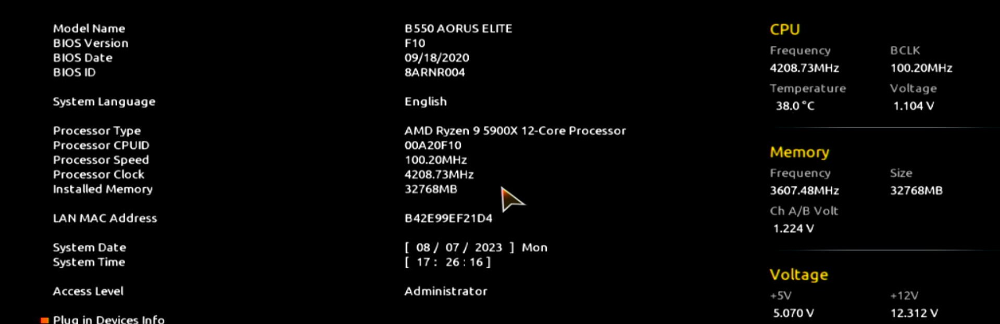

## Reveting BIOS settings to deafults


The "Save and exit" section can export the complete settings (in some binary format), so the settings
are saved as [`asus-b550-xmrig.bin`](asus-b550-xmrig.bin).

Its not easy to tell in the BIOS itself wether something is
on its default value or not, but the manual includes the default value
of (most) settings.

Not all settings are included here, but Ive tried to keep it as
complete as possible.

## Section: Tweaker

<details>
<summary>Screenshot</summary>

  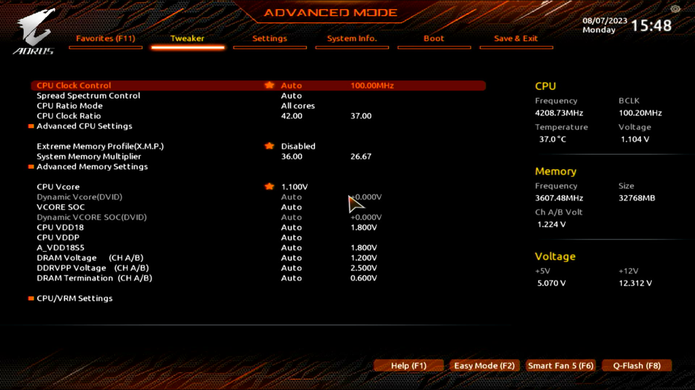

</details>

| Option                          | Value                            | Default (if changed) |
|---------------------------------|----------------------------------|----------------------|
| CPU Clock ratio                 | `42.00`                          | `Auto`               |
| Spread spectrum control         | `Auto`                           |                      |
| Extreme memory Profile (X.M.P.) | `Disabled`                       |                      |
| System memory multipler         | `36.00`                          | `Auto`               |
| CPU Vcore                       | `1.100V`                         | `Auto`               |
| CPU CDD18                       | `Auto`                           |                      |
| CPU CDDP                        | `Auto`                           |                      |
| A_CDD1885                       | `Auto` (Current value: `1.800V`) |                      |
| DRAM Voltage                    | `Auto` (Current value: `1.200V`) |                      |
| DRAMVPP Voltage                 | `Auto` (Current value: `2.500V`) |                      |
| DRAM Termination                | `Auto` (Current value: `0.600V`) |                      |

### Subsection: Tweaker -> Advanced CPU settings

<details>
<summary>Screenshot</summary>

  

</details>

| Option                    | Value                            | Default (if changed) |
|---------------------------|----------------------------------|----------------------|
| SVM Mode                  | `Enabled`                        | `Disabled`           |
| AMD Cool & Quiet          | `Enabled`                        |                      |
| PPC Adjustment            | `PState 0`                       |                      |
| Global C-state control    | `Auto`                           |                      |
| Power supply idle control | `Auto`                           |                      |
| CCD Control               | `Auto`                           |                      |
| Downcore control          | `Auto`                           |                      |
| SMT Mode                  | `Auto`                           |                      |
| CPPC                      | `Auto`                           |                      |
| CPPC Preferred cores      | `Auto`                           |                      |

### Subsection: Tweaker -> Advanced memory settings

<details>
<summary>Screenshot</summary>

  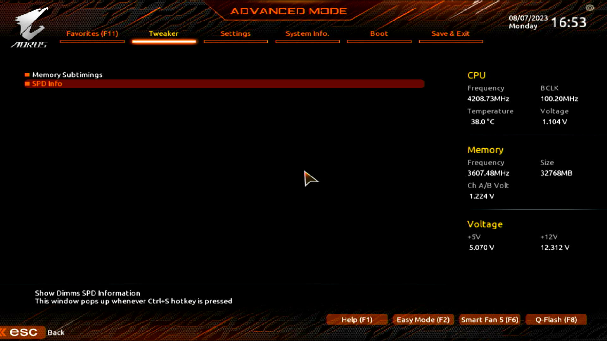

</details>

This subsection only contanis other subections

### Subsection: Tweaker -> Advanced memory settigs -> Memory subtimings

<details>
<summary>Screenshot</summary>

  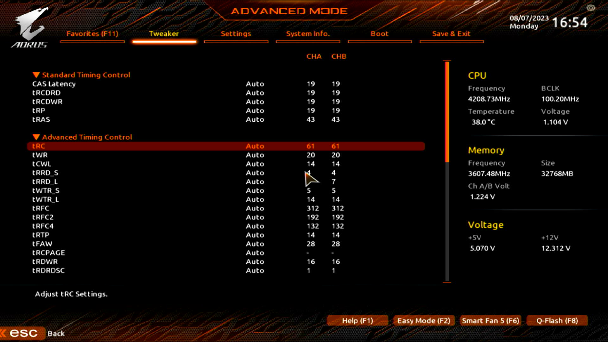

</details>

Everything in this section is set to `Auto` (the default)


### Subsection: Tweaker -> Advanced memory settings -> SPD

<details>
<summary>Screenshot</summary>

  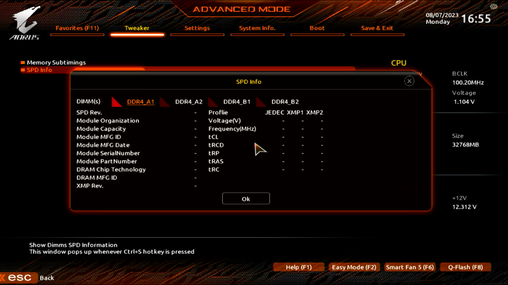

</details>

Everything in this section has their default value or no value.


### Subsection: Tweaker -> CPU/VRM settings


<details>
<summary>Screenshot</summary>

  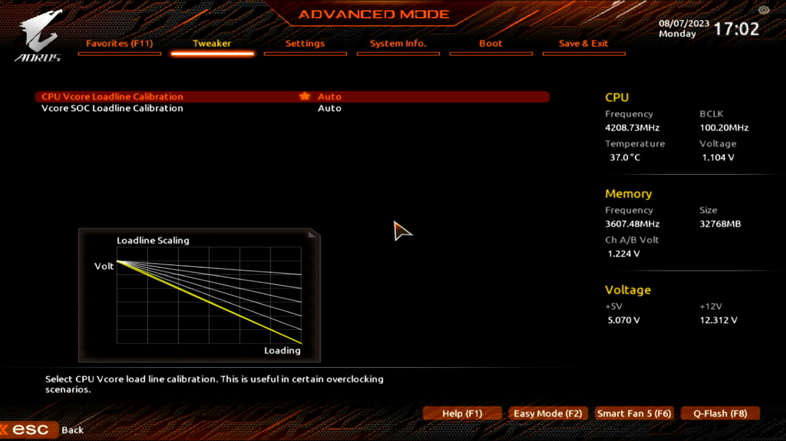

</details>

Everything in this section is set to `Auto` (the default)


## Section: Settings

<details>
<summary>Screenshot</summary>

  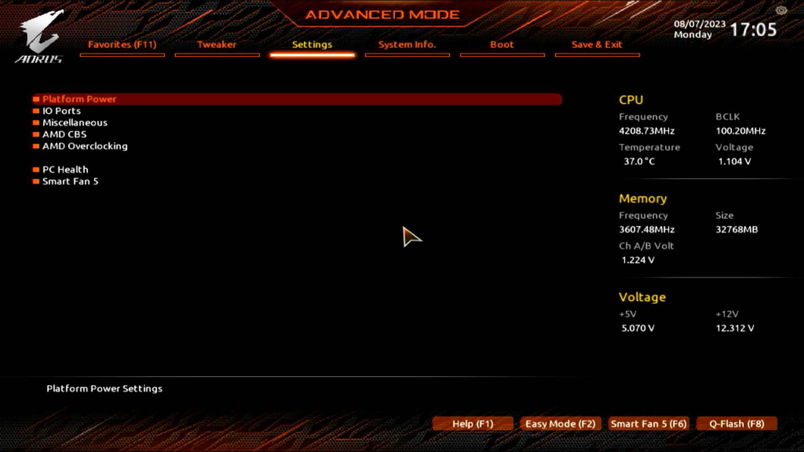

</details>


### Subsection: Settings -> Platform power

<details>
<summary>Screenshot</summary>

  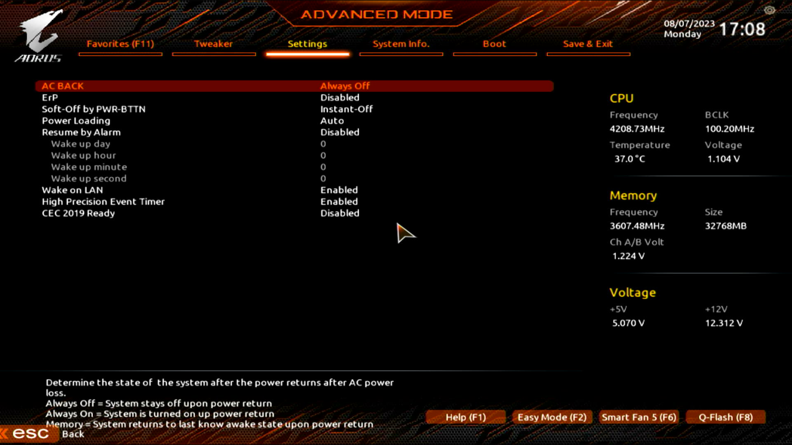

</details>

Everything in this section is set to `Auto` (the default).

| Option          | Value      | Comment                                    |
|-----------------|------------|--------------------------------------------|
| Resume by Alarm | `Disabled` | Might want to enable this in the future.   |
| Wake on LAN     | `Disabled` | Can be set if "Resume by alarm" is enabled |


### Subsection: Settings -> IO Ports


<details>
<summary>Screenshot</summary>

  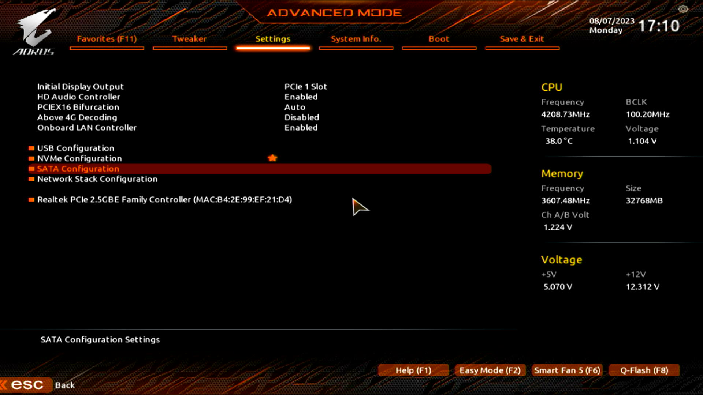

</details>

_Not relevant_

### Subsection: Settings -> IO Ports -> USB

<details>
<summary>Screenshot</summary>

  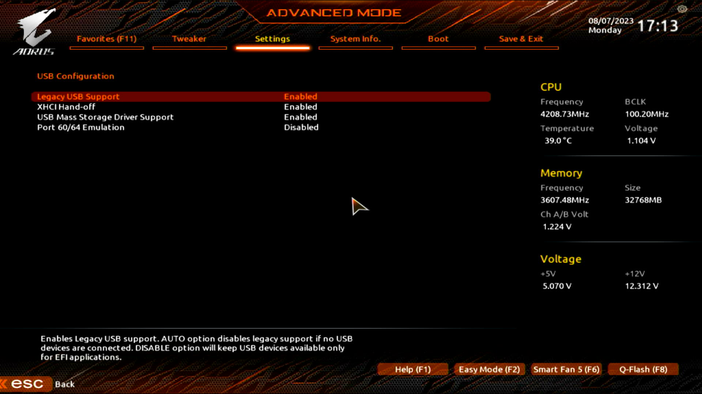

</details>

_Not relevant_

### Subsection: Settings -> IO Ports -> NVMe

<details>
<summary>Screenshot</summary>

  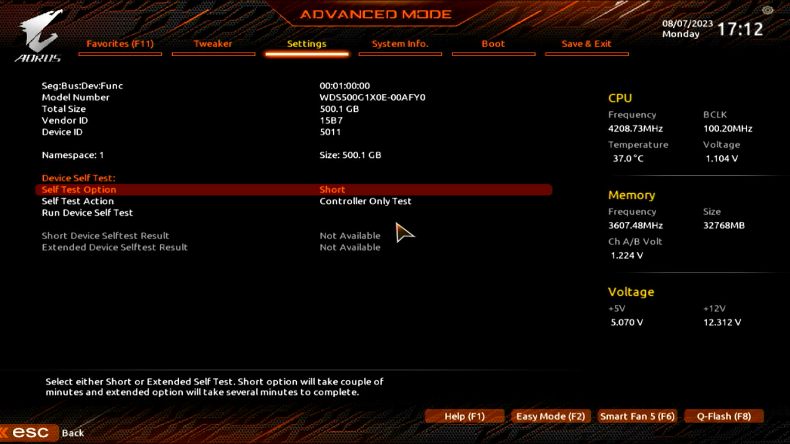

</details>

_Not relevant_

### Subsection: Settings -> IO Ports -> SATA

<details>
<summary>Screenshot</summary>

  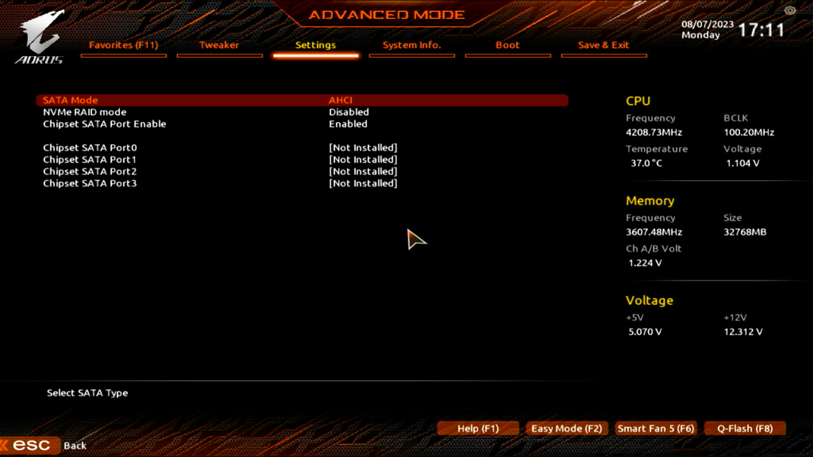

</details>

_Not relevant_

### Subsection: Settings -> IO Ports -> Network stack

_Not relevant_. Everything in this section has the default values

**NOTE**: PXE boot is enabled here

### Subsection: Settings -> Misc

<details>
<summary>Screenshots</summary>

  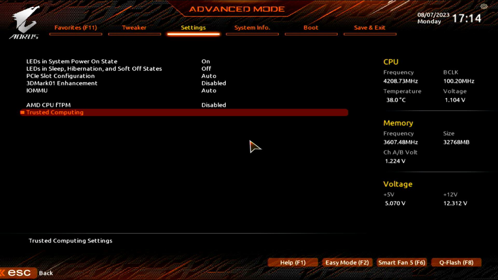
  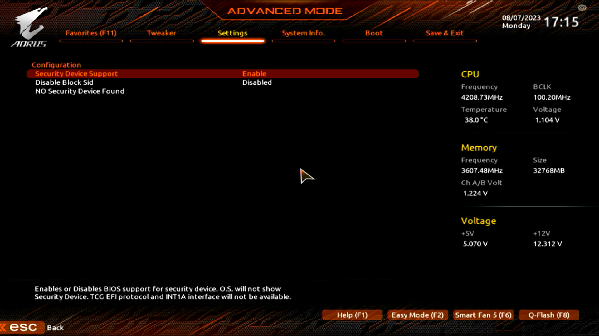

</details>

_Not relevant_. Everything in this section has the default values

### Subsection: Settings -> AMD CBS

_Not relevant_. Everything in this section has the default values

### Subsection: Settings -> AMD Overclocking

_Not relevant_. Everything in this section has the default values as
far as i can tell.

Too many subsections to screenshot

### Subsection: Settings -> PC Health

<details>
<summary>Screenshot</summary>

  

</details>

_Not relevant, there are no settings here_

### Subsection: Settings -> Smart fan

<details>
<summary>Screenshot</summary>

  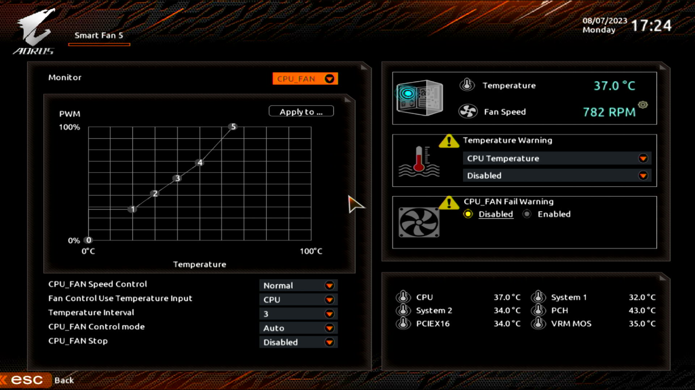

</details>

_Not relevant, there are no settings here_

## Section: System info

<details>
<summary>Screenshot</summary>

  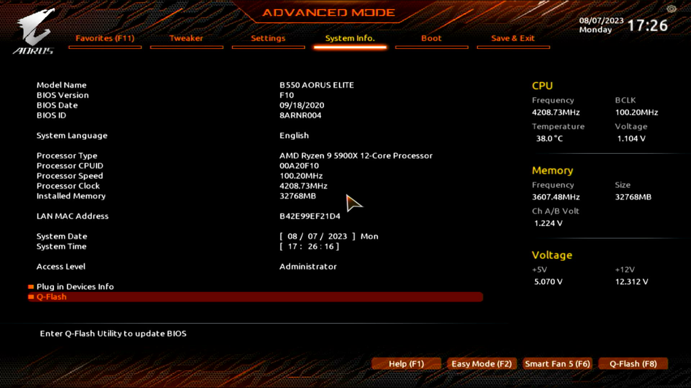

</details>

_Not relevant, there are no settings here_

### Subsection: System info -> Q-flash

<details>
<summary>Screenshot</summary>

  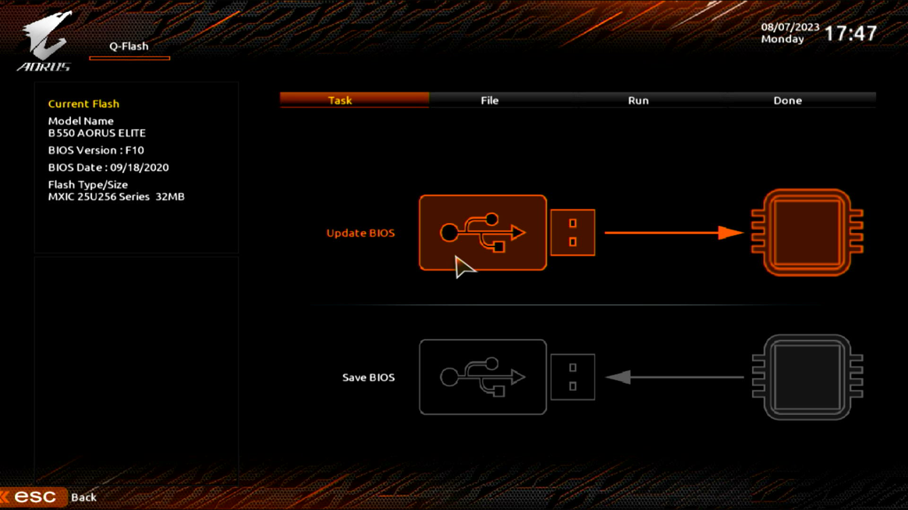

</details>

_Not relevant, there are no settings here_

**NOTE**: BIOS version information is here


| Name            | Value                     |
|-----------------|---------------------------|
| Bios Version    | `F10`                     |
| Bios date       | `2020-09-18`              |
| Flash type/size | `MXIC 25U256 Series 32MB` |


## Section: Boot

<details>
<summary>Screenshot</summary>

  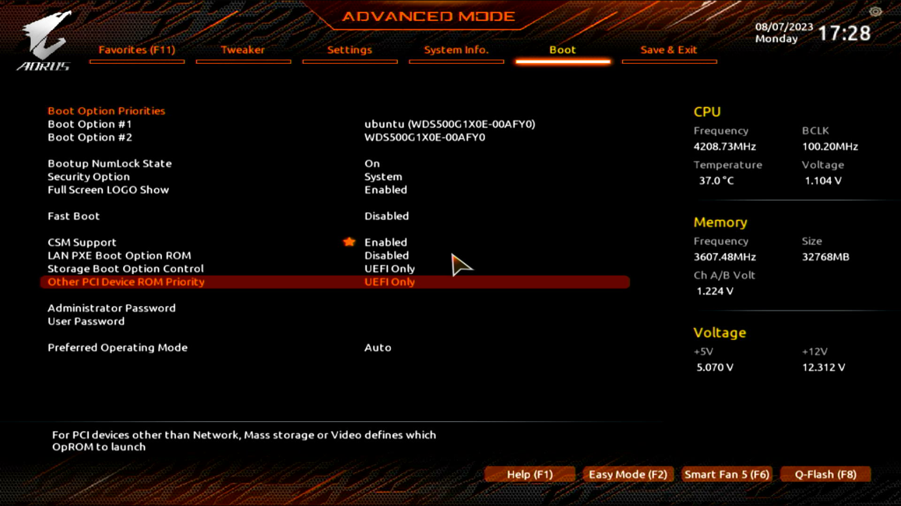

</details>

_Not relevant_


# Trying out "Eco mode"

According to [someone on reddit](https://www.reddit.com/r/AMDHelp/comments/nv0iav/pptedctdc_for_a_ryzen_5900x/), these are the default values for 5900X:

| Name | Value  |
|------|--------|
| PPT  | `142W` |
| TDC  | `95A`  |
| EDC  | `149A` |


And [someone else on reddit](https://old.reddit.com/r/Amd/comments/osuakm/eco_mode_not_showing_ryzen_master/h6qyd84/) says its the same default values as
5800X, and that ECO mode on that one sets these value to one of

| Name               | Value |
|--------------------|-------|
| PPT                | `88W` |
| TDC                | `60A` |
| EDC                | `90A` |
|--------------------|-------|
| Energy consumption | `65W` |


| Name               | Value |
|--------------------|-------|
| PPT                | `61W` |
| TDC                | `45A` |
| EDC                | `60A` |
|--------------------|-------|
| Energy consumption | `45W` |


Where to find the settings in the biosfind the settings in bios: https://www.pcworld.com/article/1352253/how-to-enable-eco-mode-with-ryzen-7000.html

<details>
<summary>Screenshot</summary>

  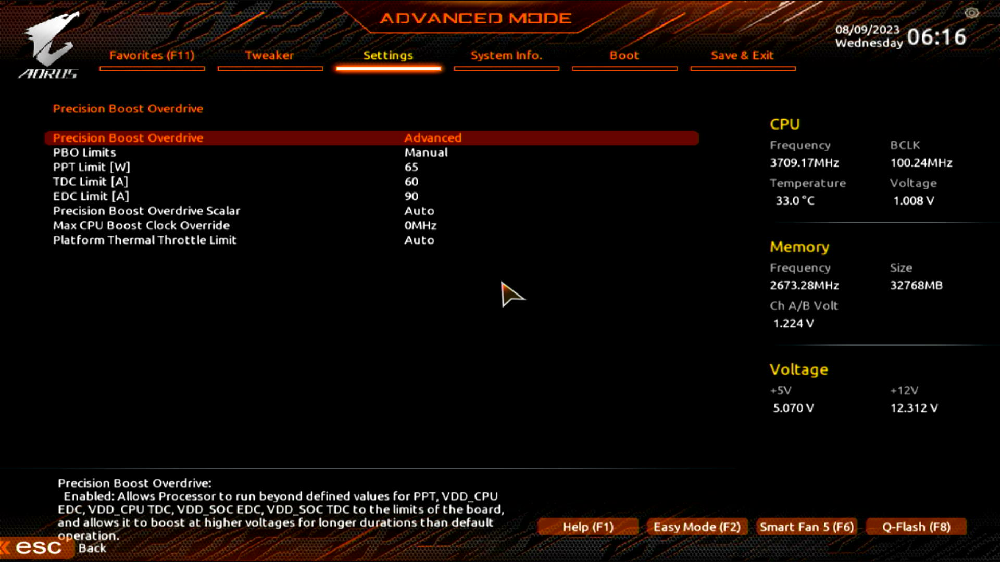

  _I misread and typed the wrong value in PPT. Couldnt boot, and restored to defaults. Will then try with the actual values

</details>


# Enable "AC BACK"

This setting controls what happens the motherboard/PSU get AC power.

Changed it to `Always on`. That means if the computer gets AC power,
it powers itself on. Good for remotely turning it on.

And Wake-on-LAN has also been enabled.
